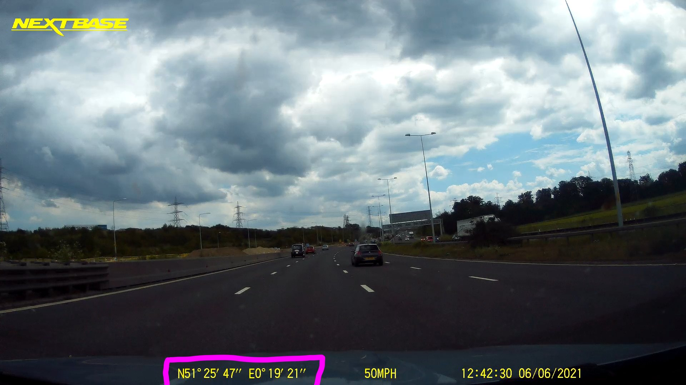

## Extract location data from DashCam footage

Some DashCam do not store GPS location in the video file itself. They embed the location in the video frame instead. For example my NextBase DashCam embed the GPS location in the bottom left corner of the video (using Degree, Minute & Second format).



The only way to extract GPS location is to process the video frames using OCR technology. `dash2gps` is a small Rust program that uses `ffmpeg` to process the video and Google's Tesseract OCR technology to extract GPS location.


## Run using Docker

The best way to run is to use docker with the [pre-built container](https://hub.docker.com/repository/docker/mustakimali/dash2gps). `cd` into the folder where you have your DashCam footage (eg. `footage.mov`)

```sh
docker run --rm --it -w /app/data -v ${PWD}:/app/data mustakimali/dash2gps footage.mov
```

The output will be the latitude & longitude:
```
51.429447,0.3236111
51.428333,0.3263889
51.427223,0.32916665
51.425556,0.33222222
51.424168,0.33555555
51.421112,0.34194446
51.44917,0.3452778
51.418613,0.34861112
51.417778,0.35166666
```


## Run locally

```sh
# Install required dependencies (for Linux)
sudo apt-get install libtesseract-dev clang

# Run the app
cargo run -- path/to/footage.mov
```

## Additional Options

* By default it looks for GPS location every 10s in the video. Override with: `--interval <NUM>`
* Update number threads to use for processing and OCR: `--threads <NUM>` (default `4`)
* For list of options try `--help`